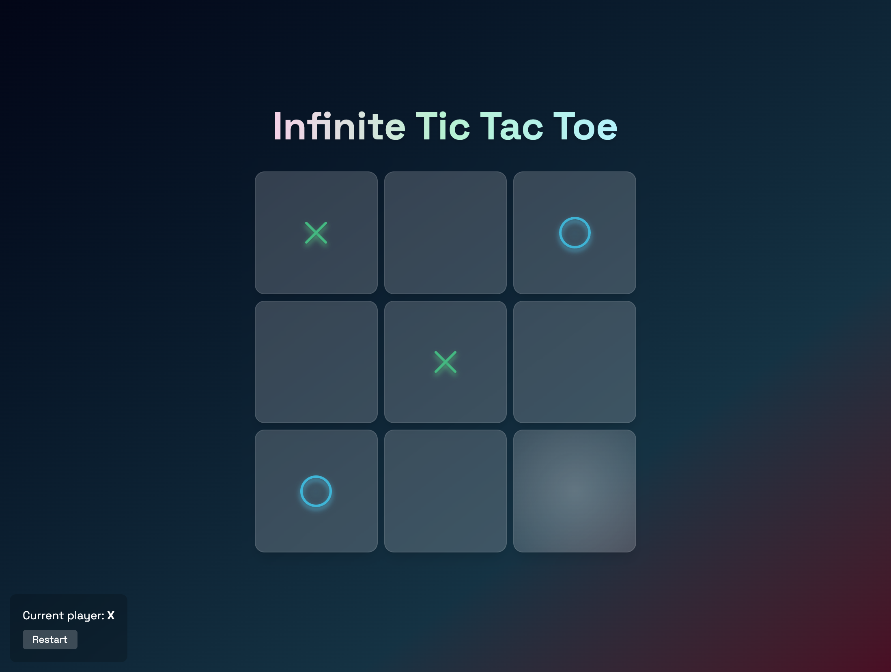

# Infinite Tic Tac Toe 🎮

A modern twist on the classic Tic Tac Toe game where pieces disappear after 6 moves, creating an infinite and dynamic gameplay experience.

🎮 [Play the game here](https://infinite-tic-tac-toe-seven.vercel.app/)



## 🎯 What is Infinite Tic Tac Toe?

Infinite Tic Tac Toe is an innovative variation of the traditional Tic Tac Toe game that introduces a time-based mechanic where pieces automatically disappear from the board after existing for 6 turns. This creates a constantly evolving game state that prevents draws and adds strategic depth to the classic formula.

## 🔄 Key Differences from Classic Tic Tac Toe

### Classic Tic Tac Toe:

- Fixed 3x3 grid that fills up permanently
- Games often end in draws
- Limited strategic depth
- Game ends when board is full or someone wins

### Infinite Tic Tac Toe:

- **Temporal Pieces**: Each piece disappears after 6 moves, keeping the board dynamic
- **No More Draws**: The constantly changing board prevents stalemate situations
- **Enhanced Strategy**: Players must think about both immediate moves and long-term piece positioning
- **Infinite Gameplay**: Games can theoretically continue indefinitely
- **Visual Feedback**: Pieces that are about to disappear (5+ moves old) pulse red as a warning

## 🎮 Game Mechanics

### Core Rules:

1. **Standard Victory**: Get three of your symbols in a row (horizontal, vertical, or diagonal) to win
2. **Piece Lifecycle**: Every piece placed on the board has a movement counter
3. **Auto-Removal**: When a piece reaches 6 movements, it automatically disappears from the board
4. **Movement Counting**: Each turn increments the movement counter for all existing pieces
5. **Re-placement**: You can place a piece on a cell that contains an opponent's piece if that piece has exactly 5 movements (about to disappear)

### Visual Indicators:

- **Fresh Pieces**: New pieces animate when placed and appear bright
- **Aging Pieces**: Pieces close to disappearing (5+ movements) pulse with a red overlay
- **Winning Pieces**: When a player wins, their winning pieces pulse with a green overlay

## 🛠️ Tech Stack

This project is built with modern web technologies focused on performance and developer experience:

### Core Framework

- **[Astro](https://astro.build/)** - Modern static site generator with partial hydration
- **[React](https://react.dev/)** - Component library for interactive UI elements
- **[TypeScript](https://www.typescriptlang.org/)** - Type-safe JavaScript for better development experience

### Styling & UI

- **[Tailwind CSS](https://tailwindcss.com/)** - Utility-first CSS framework
- **[@midudev/tailwind-animations](https://www.npmjs.com/package/@midudev/tailwind-animations)** - Additional animation utilities
- **Custom CSS** - Gradient backgrounds and custom styling

### Key Features of the Stack:

- **Partial Hydration**: Only the game board is hydrated on the client-side for optimal performance
- **Static Generation**: The app is pre-built for fast loading times
- **Modern CSS**: Uses CSS Grid, Flexbox, and advanced Tailwind features
- **Type Safety**: Full TypeScript support across components and hooks

## 🏗️ Project Structure

```
src/
├── components/
│   ├── Board.tsx       # Main game board component
│   ├── Cell.tsx        # Individual cell component with animations
│   ├── XIcon.tsx       # Animated X symbol
│   └── OIcon.tsx       # Animated O symbol
├── hooks/
│   └── useBoard.ts     # Core game logic and state management
├── layouts/
│   └── Layout.astro    # Base HTML layout
├── pages/
│   └── index.astro     # Home page
└── styles/
    └── global.css      # Global styles and CSS custom properties
```

## 🧠 Core Game Logic

The main game logic is implemented in `src/hooks/useBoard.ts` and includes:

### State Management:

- **Board State**: 3x3 grid where each cell contains value (X/O/null) and movement count
- **Current Player**: Tracks whose turn it is
- **Game Status**: Monitors if the game is playing, won, or drawn
- **Winner Detection**: Checks for traditional winning patterns

### Key Functions:

- `makeMove(index)`: Places a piece and updates all movement counters
- `isValidMove(index)`: Validates if a move is legal (empty cell or about-to-disappear piece)
- `checkWinner()`: Evaluates board for winning combinations
- `resetGame()`: Reinitializes the game state

### Movement System:

```typescript
// Each cell tracks both its value and how many moves it has existed
type CellT = {
  value: CellValue; // 'X' | 'O' | null
  movements: number; // 0-5, resets to 0 when piece disappears
};
```

## 🚀 Getting Started

### Prerequisites

- Node.js (v18 or higher)
- npm or yarn

### Installation

1. **Clone the repository**

   ```bash
   git clone <repository-url>
   cd infinite-tic-tac-toe
   ```

2. **Install dependencies**

   ```bash
   npm install
   ```

3. **Start development server**

   ```bash
   npm run dev
   ```

4. **Open in browser**
   Navigate to `http://localhost:4321`

### Build for Production

```bash
npm run build
npm run preview
```

## 🎨 Features

- **Responsive Design**: Works perfectly on desktop, tablet, and mobile devices
- **Smooth Animations**: Pieces animate when placed and when aging
- **Visual Feedback**: Clear indicators for piece status and game state
- **Modern UI**: Gradient backgrounds, glassmorphism effects, and smooth transitions
- **Accessibility**: Proper hover states and visual cues
- **Performance**: Optimized with Astro's partial hydration

## 🤝 Contributing

Feel free to submit issues and enhancement requests! This project is open for improvements and new features.

## 📄 License

This project is open source and available under the [MIT License](LICENSE).

---

Enjoy playing Infinite Tic Tac Toe! 🎉
